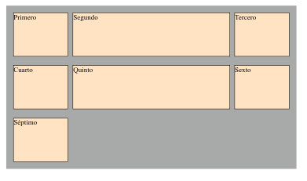
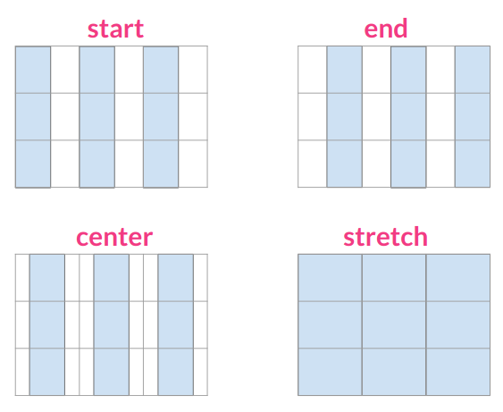
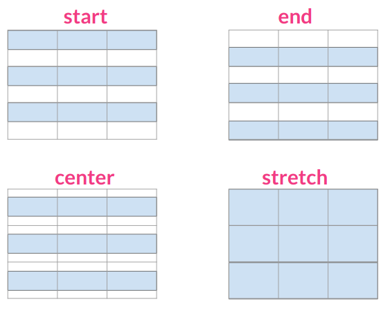
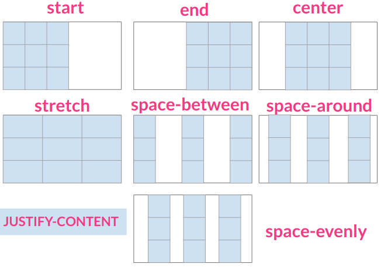
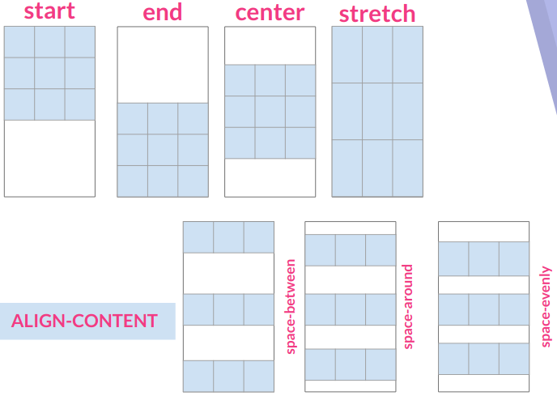

## III.2 El contenedor GRID. Propiedades

Para empezar a maquetar usando GRID lo primero que tenemos que hacer es definir cuál de nuestras etiquetas HTML se va a convertir en el **contenedor GRID**. Una vez lo hemos decidido le daremos una de estas propiedades:

- **display:grid** si queremos que nuestra rejilla (nuestro grid) sea un elemento de bloque.
- **display:inline-grid** si queremos que nuestro grid sea un elemento en línea.

Para este curso, con el objeto de que los ejemplos se muestren de manera más clara, usaremos la primera de ellas.

Una vez hemos asignado esta propiedad al contenedor, todos los elementos que contiene pasan a convertirse de manera automática en elementos del GRID cuya colocación y propiedades podremos empezar a modificar desde el contenedor.

### Definición de la estructura del GRID

Normalmente el primer paso que daremos para maquetar con GRID es definir la estructura que va a tener nuestra rejilla. Es un paso importante y para evitar problemas después es conveniente realizar una reflexión sobre ello.

Una vez hemos decidido que estructura queremos usaremos una serie de propiedades para definirla. Las más importantes para empezar son, bajo mi punto de vista, las siguientes:

- **grid-template-columns:** Para definir el número y tamaño de las diferentes columnas de mi estructura. Debo de poner tantos valores de anchura como columnas quiero que tenga el GRID.
- **grid-template-rows:** Para definir el número y tamaño de las diferentes filas de mi estructura. Debo de poner tanto valores de altura como filas quiero que tenga el GRID.
- **grid-row-gap:** Para establecer la separación entre las diferentes columnas.
- **grid-column-gap:** Para establecer la separación entre las diferentes filas.

En los dos último simplemente estamos expresando distancias pero los dos primeros tienen muchas posibilidades así que vamos a mostrar varios ejemplos:

Ejemplos con columnas:

```css
/* Tres columnas que se reparten el 100% del contenedor*/
grid-template-columns: 20% 50% 30%;

/* Cuatro columnas. Tres de tamaño fijo 100px y la otra ocupa el espacio libre restante */
grid-template-columns: 100px auto 100px 100px;

/* Cuatro columnas. Todas con un tamaño igual */
grid-template-columns: auto auto auto auto;

/* Tres columnas cada una con nombre (entre []). Dos con tamaño fijo y la otra ocupando el espacio restante */
grid-template-colums: [id] 100px [nombre] 300px [apellidos] auto;
```

Ejemplos con filas:

```css
    /* Tres filas que se reparten toda la altura del contenedor (la que sea) */
    grid-template-rows: 20% 50% 30%;

    /* Cuatro filas. Tres de altura fija 100px y la otra ocupará el resto del espacio libre hasta llenar todo el contenedor en altura.*/
    grid-template-rows: 100px auto 100px 100px;

    /* Cuatro filas que se reparten de manera equitativa el alto del contenedor */
    grid-template-rows auto auto auto auto;

    /* Tres filas (todas con nombre, entre corchetes) Dos de ellas con tamaño fijo y la restante ocupará todo el alto libre. */
    grid-template-rows: [uno] 100px [dos] 300px [tres] auto;
```

En estas dos propiedades también puedo repetir valores y usar la unidad fr que me sirve para establecer ratios para que los elementos se repartan el espacio restante. Podemos verlo mejor con un par de ejemplos.

```css
/* Cuatro columnas. Tres de 20% con nombre col-start. Y la último que ocupará el resto del espacio libre */
grid-template-columns: repeat(3, 20% [col-start]) auto;
/* Cuatro columnas. Una de tamaño fijo y las demás se reparten el espacio libre en 5 partes de la siguiente manera (2+1+2) */
grid-template-columns: 2fr 100px 1fr 2rf;
```

Aunque puede parece complejo es sencillo y con muy pocas líneas podemos consegir estructuras complejas. Para verlo vamos a poner un ejemplo:

Suponed que tengo el siguiente HTML:

```html
<div class="container">
  <div>Primero</div>
  <div>Segundo</div>
  <div>Tercero</div>
  <div>Cuarto</div>
  <div>Quinto</div>
  <div>Sexto</div>
  <div>Séptimo</div>
</div>
```

Usando solo el siguiente CSS:

```css
.container {
  background-color: #aaa;
  display: grid;
  grid-column-gap: 10px;
  grid-row-gap: 20px;
  grid-template-columns: 20% auto 20%;
  grid-template-rows: repeat(3, 100px);
  margin: 20px auto;
  padding: 1em;
  width: 80%;
}

.container > div {
  background-color: bisque;
  border: 1px solid black;
}
```

Obtengo la siguiente estructura:



Vemos cómo se han distribuido los 7 elementos en una cuadrícula, en un grid de 3x3 siguiendo la estructura que le hemos dicho.

### Alineación Horizontal

Por defecto los elementos del GRID ocupan todo el ancho de la celda que le corresponde pero podemos optar por otro tipo de alineaciones horizontales dando valores a la propiedad **justify-items**. Los diferentes valores que puede tomar son los siguientes:

- **start**
- **end**
- **center**
- **stretch** que es la opción por defecto.

Se entenderá mejor que hace cada uno mediante una explicación visual:



### Alineación Vertical

Muy similar a lo anterior. Por defecto los elementos del GRID ocupan todo el alto de la celda que le corresponde pero podemos optar por otro tipo de alineaciones verticales dando valores a la propiedad **align-items**. Los diferentes valores que puede tomar son los siguientes:

- **start**
- **end**
- **center**
- **stretch** que es la opción por defecto.

Se entenderá mejor que hace cada uno mediante una explicación visual:



Si quiero juntar estas dos últimas alineaciones usaré la propiedad **place-items** indicando primero el valor para **align-items** y después el valor para **justify-items**.

### Distribución dentro del contenedor

En determinados casos puede suceder que los elementos del GRID no ocupen todo el ancho o todo el alto del contenedor GRID. En estas ocasiones puedo distribuir las columnas y las filas usando las propiedades **justify-content** (horizontal) y **align-content** (vertical). Ambas puede tomar los mismos valores y para entender mejor esos valores y cómo funcionan vamos a presentar dos imágenes.

Para la propiedad **justify-content**:



La zona azul representa las columnas que están dentro de un rectángulo que es el contenedor GRID.

Para la propiedad **align-content**:



La zona azul representa las columnas que están dentro de un rectángulo que es el contenedor GRID.

Si quiero juntar estas dos últimas alineaciones usaré la propiedad **place-content** indicando primero el valor para **align-content** y después el valor para **justify-content**.

Curso desarrollado por [pekechis](http://github.com/pekechis) para [OpenWebinars](https://openwebinars.net/)
