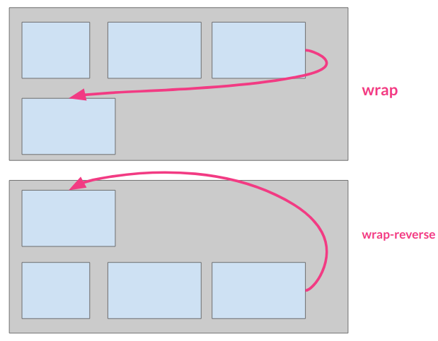
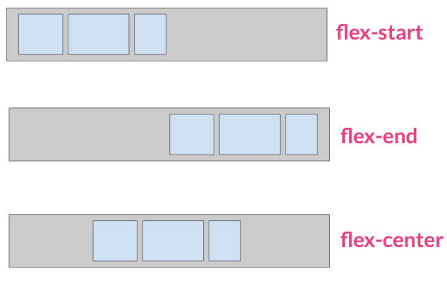
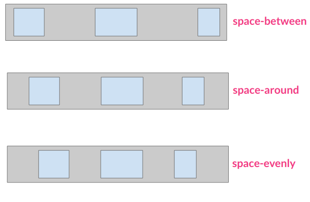
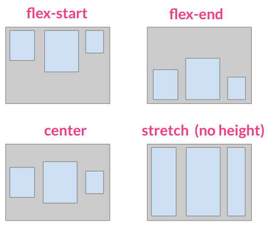
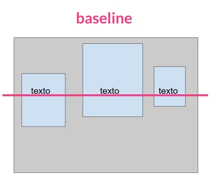
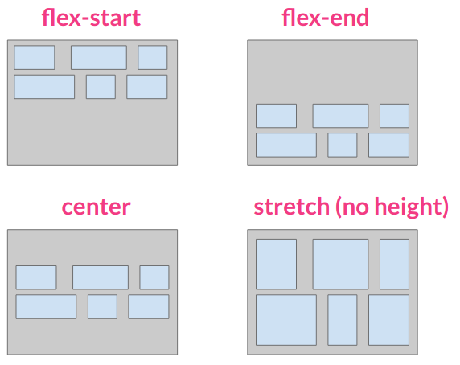
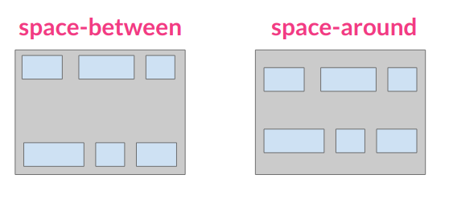

## II.2 El contenedor FLEX. Propiedades

El primer paso para maquetar usando elementos FLEX es añadir la propiedad FLEX al contenedor. En cuanto hagamos esto vamos a poder comprobar que empiezan a pasar cosas:

Si tengo este HTML:

```html
<div class="container">
  <header>
    <div><p>Primera frase</p></div>
    <div><p>Segunda frase</p></div>
    <div><p>Tercera frase</p></div>
  </header>
</div>
```

Simplemente añadiendo la propiedad **_display:flex_** podremos ver que de manera automática los elementos ajustan su anchura a su contenido y flotan a la izquierda. Y todo es simplemente poniendo una sóla regla CSS.

Además de con esta regla, desde el contenedor flex puedo modificar de manera directa varias propiedades de los elementos hijos. Por ejemplo:

- La dirección en la que se van a mostrar.
- Cómo se van a ajustar dentro del contenedor.
- La alineación horizontal de los elementos flexibles.
- La alineación vertical de los elementos flexibles cuando sólo ocupan una línea.
- La alineación vertical de los elementos flexibles cuando ocupan más de una línea.

### Dirección de los elementos flexibles.

La ajustaremos mediante la propiedad **flex-direction** que podrá tomar los siguiente valores:

- **row:** es la opción por defecto y ajustará los elementos flexibles de izquierda a derecha.
- **row-reverse:** igual que la anterior pero de derecha a izquierda.
- **column:** ajustará los elementos flexibles en columna, de arriba a abajo.
- **column-reverse:** igual que la de arriba pero de abajo a arriba.

**NOTA:** Estamos dando por supuesto que trabajamos con sistemas de escritura occidentales donde el flujo de lectura es de izquierda a derecha y de arriba a abajo. En otros sistemas de escritura los valores por defecto en nuestro navegador podrían ser otros y deberíamos revisar todo con cuidado.

### El ajuste de los elementos flexibles

Hemos visto como antes, por defecto y sin indicar ninguna anchura, los elementos flexibles adecuaban su tamaño a su contenido (si no les dábamos anchura) y se ponían todos a la izquierda permaneciendo siempre así aunque el ancho de la pantalla sea muy pequeño. Esto puede provocar desajustes en pantallas muy pequeñas. Este contratiempo podemos controlarlo usando la propiedad **flex-wrap** y eligiendo uno de los siguiente valores:

- **no-wrap:** es el valor por defecto y fuerza para que siempre los elementos estén en la misma línea aunque esto suponga que se salgan del contenedor (les haya dado o no les haya dado anchura).
- **wrap:** provoca un salto de línea si la anchura de los elementos (fijada por nosotros o por el contenedor) es superior a la del contenedor.
- **wrap-reverse:** lo mismo que arriba pero de abajo a arriba.

Podemos ver el efecto de los últimos valores en la siguiente imagen:



Las dos propiedades, **flex-direction** y **flew-wrap** podemos juntarlas en la propiedad **flex-flow** con dos partes como por ejemplo:

```css
flex-flow: row wrap;
```

### Alineación horizontal de los elementos flexibles

Podemos alinear horizontalmente los elementos flexibles, tengan o no tengan establecida una anchura, añadiendo la propiedad **justify-content** al elemento contenedor. Esta propiedad puede tener 6 valores distintos:

- **flex-start:** Los elementos flexibles se sitúan al principio.
- **flex-end:** Los elementos flexibles se situán al final.
- **center:** Los elementos se centran horizontalmente
- **space-beetween:** Distribuye el espacio restante entre los elementos pero el primero y el último están en los bordes.
- **space-around:** Distribuye el espacio restante entre los elementos pero no tiene en cuenta la distancia a los bordes.
- **space-evenly:** Distribuye el espacio restante entre los elementos y tiene en cuenta la distancia a los bordes.

Visualmente:





### Alineación vertical de los elementos flexibles

Podemos alinear verticalmente los elementos flexibles añadiendo la propiedad **align-items** que puede tomar los siguientes valores:

- **flex-start:** Los elementos se ponen junto al borde superior.
- **flex-end:** Los elementos se ponen junto al borde inferior.
- **center:** Los elementos flexibles se centran verticalmente.
- **stretch:** Los elementos crecen en altura para ocupar toda la altura del contenedor flexible. No deben tener altura fija establecida.
- **baseline:** Los elementos se alinean en relación a la primera línea de texto que posean los elementos flexibles.

Visualmente:




### Alineación vertical - Wrap (cuando tengo varias líneas)

Si he usado la propiedad **_flex-wrap:wrap_** y resulta que tengo varias líneas de elementos flexibles también puedo alinearlas usado la propiedad CSS **align-content** con valores que son análogos a los vistos antes:

- **flex-start**
- **flex-end**
- **center**
- **stretch**
- **space-between**
- **space-around**

Visualmente:




Curso desarrollado por [pekechis](http://github.com/pekechis) para [OpenWebinars](https://openwebinars.net/)
